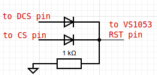

# Ka-Radio

Web radio based on ESP8266 and VS1053 \
This is a fork of https://github.com/karawin/Ka-Radio32 \
The goal of this project is to migrate to the ESP8266-RTOS-SDK 3.4 

Please note that the wiring is slightly different from the original project

## Wiring

|GPIO |NODEMCU |VS1053 |23LC1024 |LCD2004 |TSOP38238 |
|-----|--------|-------|---------|--------|----------|
|16   |D0      |XDCS   |         |        |          |
|05   |D1      |       |         |SCL     |          |
|04   |D2      |       |         |SDA     |          |
|00   |D3      |XCS    |         |        |          |
|02   |D4      |       |         |        |OUT       |
|14   |D5      |SCK    |SCK      |        |          |
|12   |D6      |MISO   |SO/SIO1  |        |          |
|13   |D7      |MOSI   |SI/SIO0  |        |          |
|15   |D8      |       |CS       |        |          |
|10   |SDD3    |DREQ   |         |        |          |
|     |        |RST    |         |        |          |

## Reset circuit
Please note that the reset circuit for VS1053 is made of 2 signal diodes 1N4148 and 1K Ohm resistor connected to the ground

## Issues
 - TIMERG0 in ota.c (line 260)
 - SSL functionality not ported

## Roadmap
 - Implement control via IR (GPIO2)
 - Add support for I2C LCD2004 or SSD1306 (GPIO4 and GPIO5)
 - Spiram auto detect
